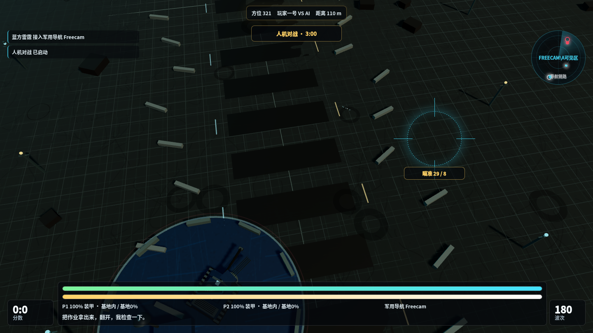

# 汪雷霆：错题星链计划



一个基于 HTML、Three.js 和 ES Modules 的原创 3D 战员对战小游戏。项目素材来自 `prompts.txt`，被拆成课堂广播和战斗文本，用于生成对战氛围。

新版画面加入程序化战术服贴图、人形战员、弹坑、跑道灯、远景山脊、星空、烟尘和多层战斗灯光；战斗地图也扩大为更开阔的星链靶场。

## 模式

- 本地双人：同屏两名玩家对战
- 人机对战：玩家一号对抗 AI 战员
- 机机对战：两名 AI 自动决斗
- 基地规则：每方都有基地，敌方攻陷基地会直接获胜
- 军用导航：战员必须在己方基地内才会接入基地雷达链路，雷达只标记未被建筑遮挡的目标
- 烧开水补能：移动和开枪都会消耗能量，只有回到己方基地烧开水才能恢复能量
- 近防炮：基地内可手动瞄准近防炮压制，理论射速 13000 发/分钟，同样消耗能量

## 运行

```bash
python3 -m http.server 4173 --bind 0.0.0.0
```

打开 `http://127.0.0.1:4173/`。

也可以使用：

```bash
npm run serve
```

## 本地客户端

项目已加入 Electron 本地客户端。安装依赖后可以直接启动桌面窗口：

```bash
npm install
npm run client
```

在 Windows 上本地打包：

```bash
npm run build:win
```

打包产物会输出到 `dist/windows/`，包括 Windows 安装包和便携版。

## GitHub Actions

仓库包含 `.github/workflows/windows-client.yml`，会在 `main` / `master` 推送、Pull Request 或手动触发时，在 `windows-latest` 环境中运行：

```bash
npm ci
npm run build:win
```

完成后可以在 Actions 页面下载 `wang-thunder-windows-client` artifact。

## 操作

- 玩家一号：`WASD` 移动，鼠标移动准心，`空格` 或鼠标按下开火
- 玩家二号：方向键移动，`Enter` 开火
- 基地内：自动接入基地雷达链路，烧开水补充能量，并可触发近防炮压制
- `P` / `Esc`：暂停或继续

## 验证

```bash
npm install
npx playwright install chromium
npm run verify
```

验证脚本会分别启动人机、本地双人、机机对战，并在桌面/移动视口截图和抽样 WebGL canvas 像素，确认模式入口和 3D 画面有效。

## 结构

- `index.html`：游戏壳、开屏 Logo、菜单、HUD、准星和结算层
- `styles.css`：开屏动画、响应式布局和游戏 UI
- `src/data/prompts.js`：从 `prompts.txt` 整理出的词条库
- `src/js/core`：输入、音频、存档、事件总线、场景管理和 3D 工厂
- `src/js/scenes`：开屏、菜单、游戏、结算场景
- `src/vendor/three.module.js`：本地 Three.js 模块
